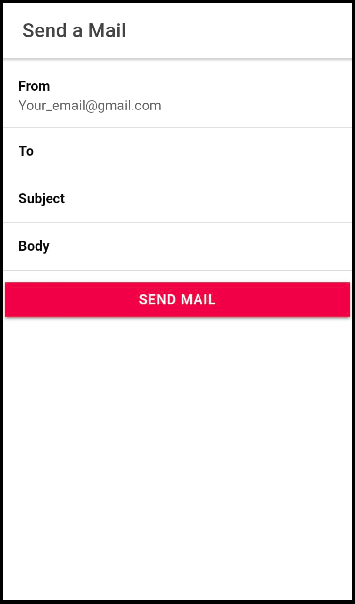

    
 
 

# VoiceMail
Voicemail is a mobile application, that serves as a voice based email client for the visually impaired and helps them in sending and receiving mails by the use of just voice and touch commands.

# Features
- Uses IVR(Interactive voice response) to communicate with the user.
- Sign-in to your email account.
- Send mails comprising of both html and text contents.
- Read inbox and display mails in a list.

# Working
- Uses client-server architecture to send and receive mails.
- The [mail-server](https://github.com/SaurabhNandy/Email-API) is a Flask application hosted on [Pythonanywhere](https://www.pythonanywhere.com) that uses python to access smtp and imap servers.
- Mobile app communucates with the server using http requests.

# Screenshots

      
        
     
      
        
     
      
        
     
      
        
     

# TODOs
- [ ] Integrate Gmail api with the application
- [ ] Create different folders for received mails like sent, trash, etc.
- [ ] Add attachment support for mails.

 

---
[Downlad APK](https://drive.google.com/file/d/1r6QzpQO9srxdJ7rvyfD2IxwZNZbLZd0P/view?usp=sharing)

This project was developed as a part of our college course MCAN mini-project.
